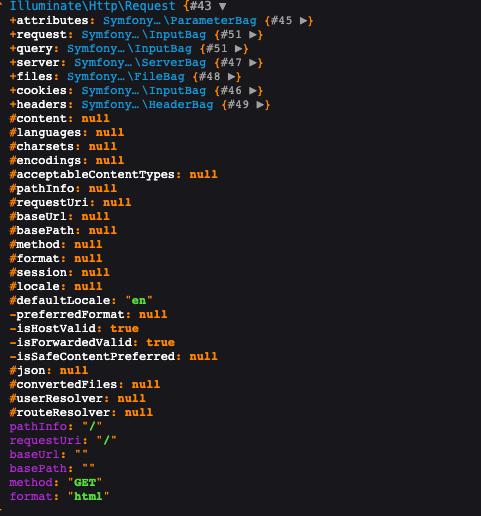

### Laravel中的Request对象是如何实现的?

在用laravel日常开发中，`Illuminate\Http\Request`对象到处有它的身影, HTTP请求的所有相关参数都会经过这个类，平常做业务开发的时候用的很舒服，
却很少去思考这个类究竟是如何实现的，怎么做到如此优雅的？




#### Request是如何初始化？

在`index.php`中, `Request::capture()` 这行代码就是生成一个 `Request`对象，然后通过 Http Kernel 处理请求

```php
// ...
$kernel = $app->make(Kernel::class);

$response = $kernel->handle(
    $request = Request::capture() // 就是这一行
)->send();
```

#### 从发起请求到控制器，请求参数，请求方法，请求头，文件等这些参数是如何绑定到该类中的？

1. 进入到`capture`方法中，就可以看到下面代码，可以看到Laravel的`Request`类核心是依赖 [Symfony](https://symfony.com/doc/current/components/http_kernel.html)
```php
public static function capture()
{
    static::enableHttpMethodParameterOverride();

    return static::createFromBase(SymfonyRequest::createFromGlobals()); // SymfonyRequest::createFromGlobals() 是Symfony组件
}
```

2. 点击进入到 `createFromGlobals` 中， 可以看到它又一次调用了 `self::createRequestFromFactory()`方法，并且将
熟悉的超全局变量传入到 `createRequestFromFactory` 中了， 接着便实例化自己`new static`, 最后将参数绑定对象的属性上，然后返回给Laravel

```php
// 第一步
public static function createFromGlobals()
{
    $request = self::createRequestFromFactory($_GET, $_POST, [], $_COOKIE, $_FILES, $_SERVER);

    if (str_starts_with($request->headers->get('CONTENT_TYPE', ''), 'application/x-www-form-urlencoded')
        && \in_array(strtoupper($request->server->get('REQUEST_METHOD', 'GET')), ['PUT', 'DELETE', 'PATCH'])
    ) {
        parse_str($request->getContent(), $data);
        $request->request = new InputBag($data);
    }

    return $request;
}

// 第二步
private static function createRequestFromFactory(array $query = [], array $request = [], array $attributes = [], array $cookies = [], array $files = [], array $server = [], $content = null): self
{
    if (self::$requestFactory) {
        $request = (self::$requestFactory)($query, $request, $attributes, $cookies, $files, $server, $content);

        if (!$request instanceof self) {
            throw new \LogicException('The Request factory must return an instance of Symfony\Component\HttpFoundation\Request.');
        }

        return $request;
    }

    return new static($query, $request, $attributes, $cookies, $files, $server, $content);
}

// 第三步 将参数绑定到各自的对象中
// 这里就熟悉了原来，将超全局变量用不同的类进行绑定，在绑定到 Request 类中的
 public function initialize(array $query = [], array $request = [], array $attributes = [], array $cookies = [], array $files = [], array $server = [], $content = null)
{
    $this->request = new InputBag($request);
    $this->query = new InputBag($query);
    $this->attributes = new ParameterBag($attributes);
    $this->cookies = new InputBag($cookies);
    $this->files = new FileBag($files);
    $this->server = new ServerBag($server);
    $this->headers = new HeaderBag($this->server->getHeaders());

    $this->content = $content;
    $this->languages = null;
    $this->charsets = null;
    $this->encodings = null;
    $this->acceptableContentTypes = null;
    $this->pathInfo = null;
    $this->requestUri = null;
    $this->baseUrl = null;
    $this->basePath = null;
    $this->method = null;
    $this->format = null;
}
```

3. 最后Laravel 克隆了 `SymfonyRequest` 类，并且加入一些自定义参数

```php
public static function  createFromBase(SymfonyRequest $request)
{
    // duplicate 方法进行类克隆操作
    $newRequest = (new static)->duplicate(
        $request->query->all(), $request->request->all(), $request->attributes->all(),
        $request->cookies->all(), $request->files->all(), $request->server->all()
    );

    $newRequest->headers->replace($request->headers->all());

    $newRequest->content = $request->content;

    $newRequest->request = $newRequest->getInputSource();

    return $newRequest;
}
```

拿到`Request`对象之后,将对象注入到容器，后续控制器的所有操作都直接从容器中拿到该对象了，最后将我们的业务数据通过 `(new Response(200, $header, $data))->send()` 返回给浏览器

总结: Request类的其实就是对$_GET,$_POST,$_FILES,$_SERVER几个超全局变量的高度封装