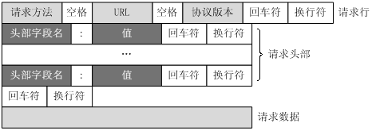
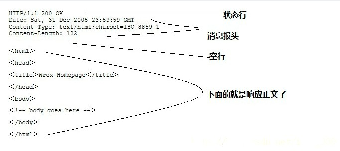
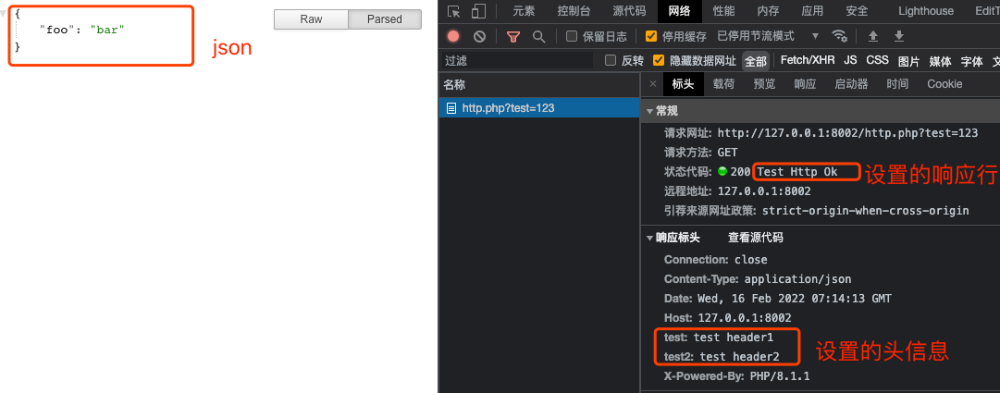

### PHP中如何接收HTTP消息，如何返回HTTP消息？

#### HTTP是什么？

HTTP 是一个超文本传输协议, 专门链接计算机两点之间传输文字，图片，音视频等超文本数据，它是一种通信规范,
有了HTTP，浏览器能很方便的与web服务器进行数据传输，这些数据通过HTML标签的形式展示出来

- 文档: [HTTP协议入门](http://www.ruanyifeng.com/blog/2016/08/http.html)
- HTTP是基于TCP/IP协议的，TCP提供可靠性，字节流形式的通信，保证数据的可靠性，IP可以负责路由，寻址，保证数据能够被送达对的服务器中
- 所以在浏览器中输入一个ip或者域名(DNS)，会先跟对应的web服务器建立TCP链接，成功之后发送HTTP请求报文
- 最后应用程序也按照对应的HTTP协议规范返回响应信息给浏览器
- HTTP请求消息，包含 请求行、请求头部、空行和请求数据四个部分组成，如下图:

- 服务器响应消息: 状态行、消息报头、空行和响应正文



### PHP中处理响应信息

根据在PHP中，我们可以根据客户端的请求消息，进行逻辑处理，然后按照HTTP协议返回正确响应消息


- PHP可以通过`$_SERVER`, `$_GET`, `$_POST`, `$_COOKIE`, `$_FILES` 等获取HTTP请求信息
```php
<?php

$server = $_SERVER;

// get
$get = function ($key = '') {
    if ($key) {
        return $_GET[$key] ?? '';
    }
    return $_GET;
};

// post
$post = function ($key = '') {
    if ($key) {
        return $_POST[$key] ?? '';
    }
    return $_POST;
};

// 协议版本号
$protocol = $server['SERVER_PROTOCOL'];

// 请求方法
$method = $server['REQUEST_METHOD'];

// 获取HTTP协议版本与请求方法
echo $method.' '.$protocol.'<br/>';

// 请求HOST
echo $server['SERVER_NAME'].'<br/>';

// 请求端口
echo $server['SERVER_PORT'].'<br/>';

echo '<pre>';

// 获取GET数据信息
print_r($get());

// 获取POST信息
print_r($post());

// 获取cookie
print_r($_COOKIE);

// 获取文件
print_r($_FILES);

// 获取请求头信息
print_r(getallheaders());

echo '<hr/>';
```

- 通过 `header()` 方法设置响应头信息，然后输出我们的数据信息

```php
// 设置响应信息
$headerStr = sprintf('HTTP/%s %s %s', '1.1', 200, 'Test Http Ok');
header($headerStr);
header('test: test header1');
header('test2: test header2');
// 设置标头，告诉浏览器我返回的是json数据
header('Content-Type: application/json');
$data = ['foo' => 'bar'];
echo json_encode($data);
```

